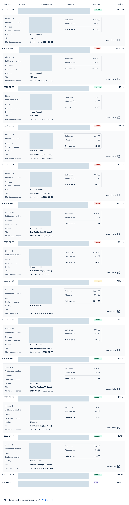
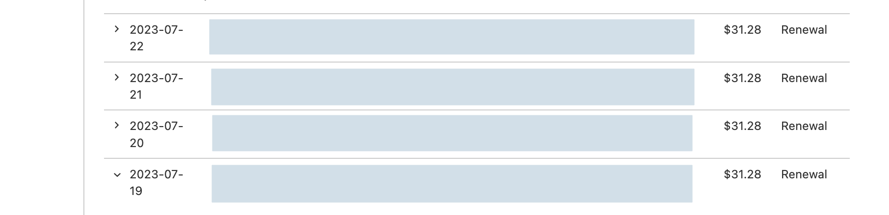
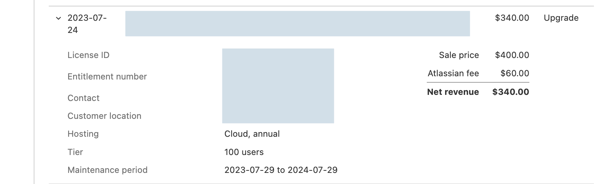
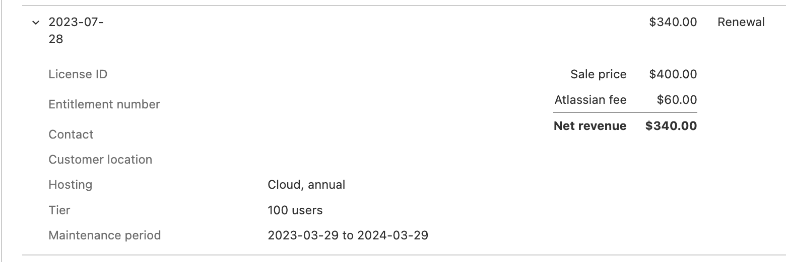

# Trying to explain many payments and refunds in quick succession

Question to Ecosystem help (ECOHELP-22840 but private)

## Question:

I see a whole load of transactions that I cannot understand here:

Please can you make sense of what is going on because I can’t understand it.

## Answer from:

Apologies for the confusion. Since the customer wanted to move back to annual subscription from monthly subscription 
hence $ 31.28 was refunded back to customer from 2023-03-29 to 2023-07-29.

 

Also the customer has paid for annual subscription already from 2023 July to 2024 July.

Hence this amount was also refunded. And we created a new quote for the customer from 2023-03-29 to 2024-03-29 
which they paid on 2023-07-28 and the same is visible on your reporting.

Also please ignore the $0 transaction created with maintenance start and end date being same. This was created due to human error.
